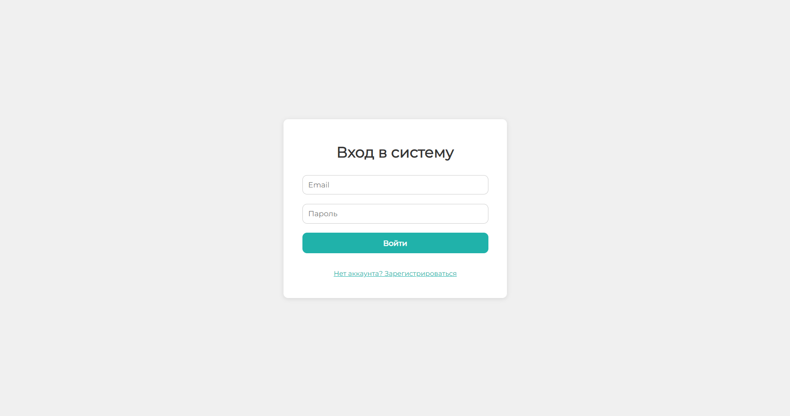
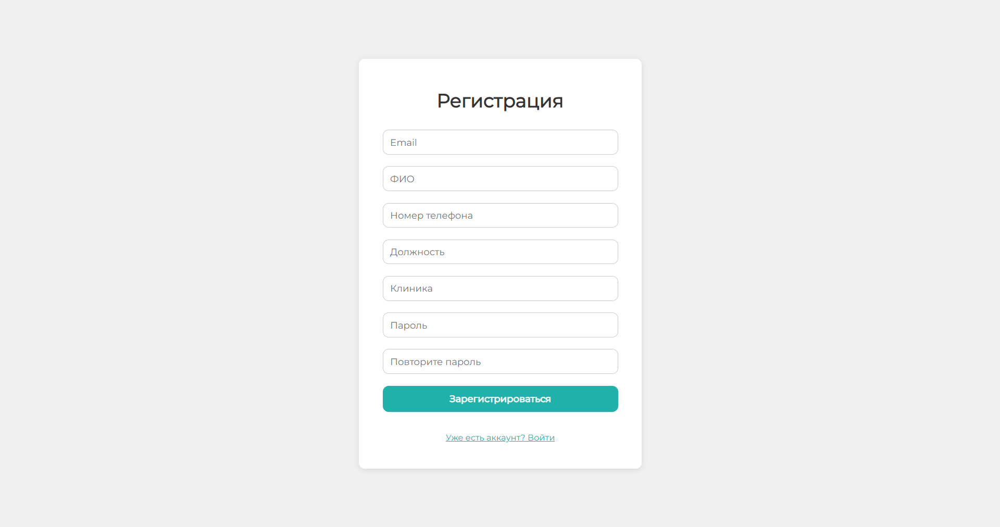
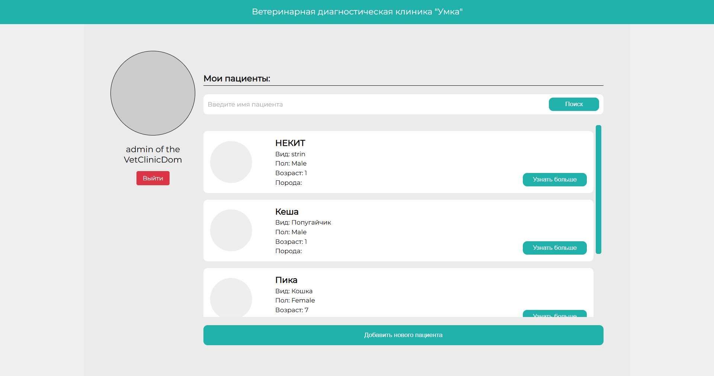
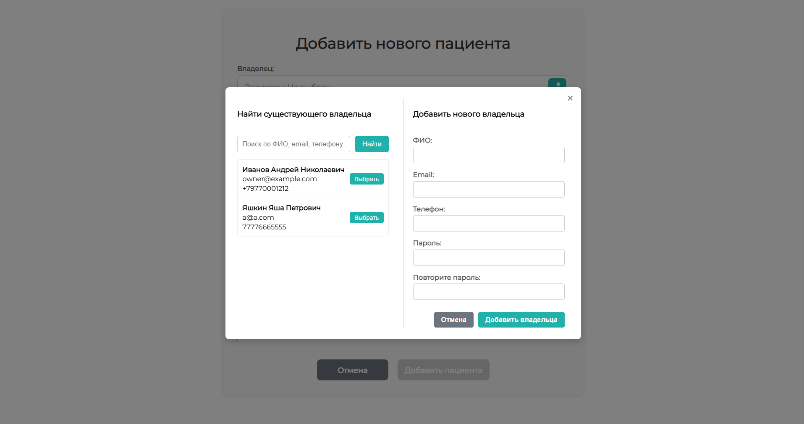
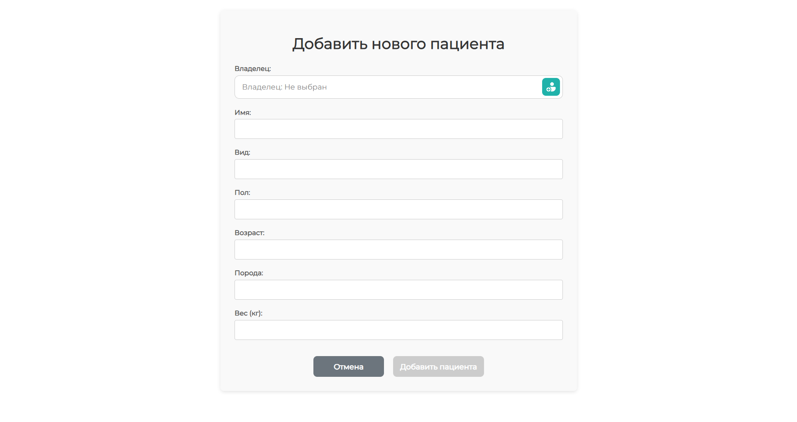
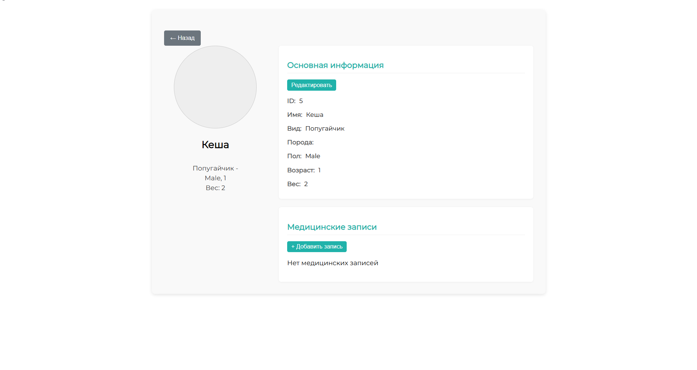
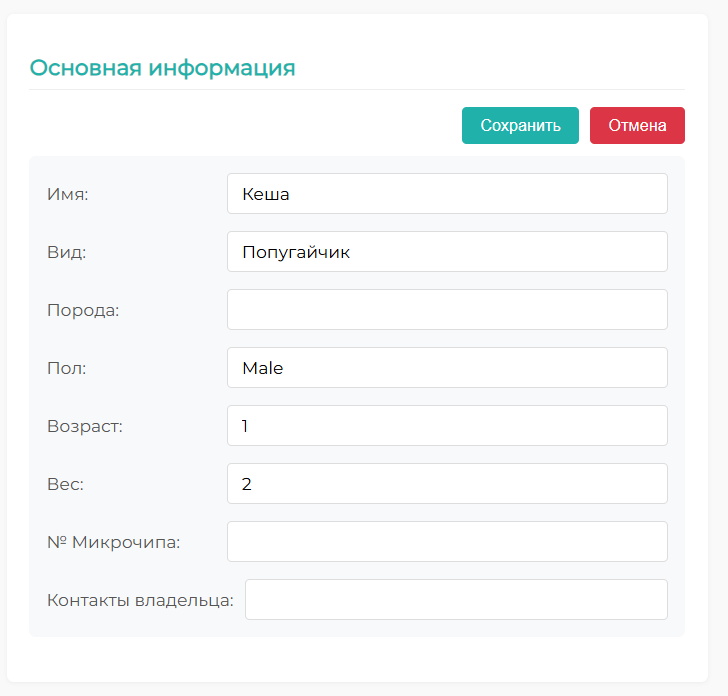
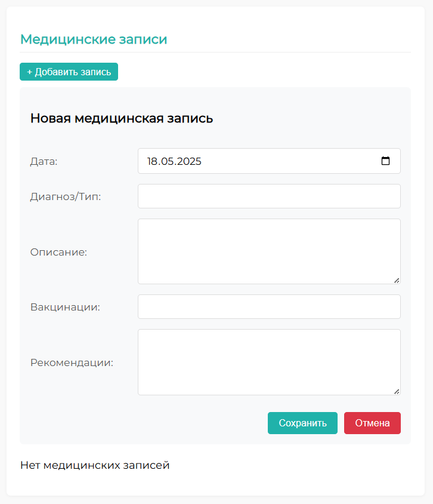

# Документация VDC Electron-React приложения

## 1. Обзор приложения

### 1.1 Технологический стек
- **Frontend**: React 19, TypeScript
- **Билд-система**: Vite
- **Настольное приложение**: Electron
- **Маршрутизация**: React Router
- **Стили**: SCSS
- **Хранение данных**: electron-store
- **Аутентификация**: JWT

### 1.2 Архитектура
Приложение использует архитектуру Electron с:
- Главным процессом (main.ts) - отвечает за создание окон и IPC-коммуникацию
- Рендер-процессом (renderer.tsx) - React-приложение
- Прелоадером (preload.ts) - безопасный мост между процессами

## 2. Основные компоненты

### 2.1 Главное окно
- Размер: 1440x1024 пикселей
- Полноэкранный режим по умолчанию
- Отключена панель меню

### 2.2 IPC-коммуникация
Основные IPC-каналы:
- `load-all-pets` - загрузка списка питомцев
- `add-pet` - добавление нового питомца
- `login` - аутентификация пользователя
- `get-all-owners` - получение списка владельцев

## 3. Инструкции по запуску

### 3.1 Разработка
```bash
npm run dev
```
Запускает:
1. Vite dev-сервер на порту 5173
2. Electron приложение с подключением к dev-серверу

### 3.2 Производственная сборка
```bash
npm run build
```
Создает:
1. Оптимизированную сборку фронтенда
2. Компилирует TypeScript-код Electron

### 3.3 Запуск production-версии
```bash
npm start
```

## 4. Функциональные страницы

### 4.1 Страница аутентификации (AuthPage)
Компонент расположен в `src/pages/AuthPage.tsx`




#### Функциональность:
- Два режима работы: вход и регистрация
- Валидация паролей при регистрации
- Обработка ошибок аутентификации
- Локализация на русский язык

#### Поля формы:
- **Общие для входа и регистрации**:
  - Email
  - Пароль

- **Только для регистрации**:
  - ФИО
  - Номер телефона
  - Должность
  - Клиника
  - Подтверждение пароля

#### IPC-взаимодействие:
- `window.sessionAPI.login()` - вход пользователя
- `window.sessionAPI.registerVet()` - регистрация ветеринара

### 4.2 Главная страница (MainPage)
Компонент расположен в `src/pages/MainPage.tsx`



#### Функциональность:
- Отображение списка пациентов (питомцев)
- Поиск по имени питомца
- Просмотр основной информации о питомце
- Навигация к странице добавления нового питомца
- Навигация к детальной странице питомца
- Выход из системы

#### Основные элементы:
- **Шапка**: Название клиника "Умка"
- **Информация о пользователе**:
  - ФИО
  - Аватар
  - Кнопка выхода
- **Поиск**:
  - Поле ввода имени
  - Кнопка поиска
- **Список пациентов**:
  - Фото
  - Имя
  - Вид животного
  - Пол
  - Возраст
  - Порода
  - Кнопка "Узнать больше"
- **Кнопка добавления**:
  - "Добавить нового пациента"

#### IPC-взаимодействие:
- `window.petAPI.loadAll()` - загрузка списка питомцев
- `window.petAPI.updatePet()` - обновление данных питомца
- `window.petAPI.getMedicalEntries()` - получение медицинских записей (с пагинацией)
- `window.petAPI.addMedicalEntry()` - добавление новой медицинской записи

#### Добавление питомца:
##### Поля:
- **Обязательные**:
  - Владелец (выбор из списка или добавление нового)
  - Имя питомца
  - Вид животного
  - Пол
  - Возраст
  - Порода
- **Опциональные**:
  - Вес
  - Другие медицинские параметры

 


#### IPC-взаимодействие:
- `window.petAPI.loadAll()` - загрузка текущих питомцев
- `window.petAPI.addPet()` - добавление нового питомца

### 4.3 Страница питомца (PetPage)
Компонент расположен в `src/pages/PetPage.tsx`


 
 

#### Функциональность:
- Отображение полной информации о питомце
- Редактирование данных питомца
- Управление медицинскими записями
- Навигация назад к списку питомцев
- Загрузка данных при монтировании компонента
- Обработка ошибок загрузки

#### Основные разделы:
- **Левая колонка**:
  - Фото питомца
  - Основная информация (имя, вид, порода, пол, возраст)
  - Технические данные (микрочип, вес)

- **Правая колонка**:
  - **Основная информация** (с возможностью редактирования)
  - История болезни
  - Состояние здоровья
  - Диагностика
  - План лечения
  - **Медицинские записи**:
    - Список записей с пагинацией (20 записей за раз)
    - Форма добавления новой записи
    - Просмотр деталей каждой записи

#### Редактирование данных:
- Доступно через кнопку "Редактировать"
- Поля для редактирования:
  - Имя, вид, порода, пол
  - Возраст, вес, микрочип
  - Контакты владельца
- Кнопки "Сохранить"/"Отмена"

#### Медицинские записи:
- Автоматическая подгрузка при скролле
- Каждая запись содержит:
  - Дата осмотра
  - Диагноз/тип осмотра
  - Описание состояния
  - Вакцинации
  - Рекомендации
- Форма добавления новой записи:
  - Дата (по умолчанию текущая)
  - Диагноз/тип
  - Описание
  - Вакцинации
  - Рекомендации

#### IPC-взаимодействие:
- `window.petAPI.loadAll()` - загрузка списка питомцев
- `window.petAPI.updatePet()` - обновление данных питомца
- `window.petAPI.getMedicalEntries()` - получение медицинских записей
- `window.petAPI.addMedicalEntry()` - добавление медицинской записи

## 5. Модели данных

### 5.1 Пользователь (UserSession)
```typescript
interface UserSession extends Vet {
  token?: string; // JWT токен
}
```

### 5.2 Ветеринар (Vet)
```typescript
interface Vet {
  id: number;
  fullname: string; // ФИО
  email?: string;
  phone?: string;
  clinic_number?: string; // Номер клиники
  position?: string; // Должность
  picSource?: string; // Фото
}
```

### 5.3 Питомец (Pet)
```typescript
interface Pet {
  id: number;
  name: string; // Имя
  animal_type: string; // Вид животного
  gender: string; // Пол
  age: number; // Возраст
  breed: string; // Порода
  weight?: number; // Вес
  behavior?: string; // Поведение
  condition?: string; // Состояние
  research_status?: string; // Статус исследований
  contacts?: string; // Контакты владельца
  picSource?: string; // Фото
  history?: string; // История болезни
  healthState?: string; // Состояние здоровья
  diagnostic?: string; // Диагноз
  treatmentPlan?: string; // План лечения
  num_mic?: string; // Номер микрочипа
}
```

### 5.4 Владелец (PetOwner)
```typescript
interface PetOwner {
  id: number;
  fullname: string; // ФИО
  email?: string;
  phone?: string;
}
```

## 6. Работа с API

### 6.1 Общая информация
Приложение взаимодействует с двумя сервисами:
- **Сервис аутентификации**: `http://localhost:8083`
- **Сервис данных**: `http://localhost:8081`

Все запросы используют:
- Content-Type: application/json
- Для авторизованных запросов: Bearer token в заголовке Authorization

### 6.2 Аутентификация

#### Вход пользователя
```typescript
signIn(email: string, password: string): Promise<{ token: string }>
```
- Метод: POST
- URL: `/auth/v1/sign-in`
- Тело запроса: { email, password }

#### Регистрация ветеринара
```typescript
registerVet(payload: RegisterVetPayload): Promise<{ token: string }>
```
- Метод: POST
- URL: `/auth/v1/sign-up/vet`
- Тело запроса: { fullname, email, password, phone?, clinic_number?, position? }

#### Регистрация владельца
```typescript
registerOwner(payload: RegisterOwnerPayload): Promise<{ token: string }>
```
- Метод: POST
- URL: `/auth/v1/sign-up/owner`
- Тело запроса: { fullname, email, password?, phone? }

### 6.3 Работа с владельцами

#### Получение списка владельцев
```typescript
getAllOwners(token: string): Promise<PetOwner[]>
```
- Метод: GET
- URL: `/auth/v1/owner`
- Требуется авторизация

### 6.4 Работа с питомцами

#### Получение списка питомцев
```typescript
getAllPets(token: string): Promise<Pet[]>
```
- Метод: GET
- URL: `/info/v1/pets`
- Требуется авторизация

#### Работа с питомцами

##### Получение списка питомцев
```typescript
getAllPets(token: string, filters?: PetFilters): Promise<Pet[]>
```
- Метод: GET  
- URL: `/info/v1/pets`  
- Параметры запроса (опциональные):
  - `pet_id` - ID конкретного питомца
  - `vet_id` - ID ветеринара
  - `owner_id` - ID владельца
  - `offset` - смещение для пагинации
  - `limit` - количество записей (по умолчанию 20)
- Требуется авторизация

##### Получение данных питомца
```typescript
getPetById(token: string, id: number): Promise<Pet>
``` 
- Метод: GET  
- URL: `/info/v1/pets/{id}`  
- Требуется авторизация

##### Добавление питомца
```typescript
createPet(token: string, payload: CreatePetPayloadDTO): Promise<{ id: number }>
```
- Метод: POST  
- URL: `/info/v1/pets`  
- Тело запроса: 
  ```typescript
  {
    name: string;
    animal_type: string;
    gender: string;
    age: number;
    owner_id: number;
    vet_id: number;
    weight?: number;
    behavior?: string;
    condition?: string; 
    research_status?: string;
  }
  ```
- Требуется авторизация

##### Обновление питомца
```typescript
updatePet(token: string, id: number, payload: UpdatePetDTO): Promise<void>
```
- Метод: PUT  
- URL: `/info/v1/pets/{id}`  
- Тело запроса (все поля опциональны, обновляются только переданные):
  ```typescript
  {
    name?: string;
    animal_type?: string;
    gender?: string;
    age?: number;
    weight?: number;
  }
  ```
- Требуется авторизация
